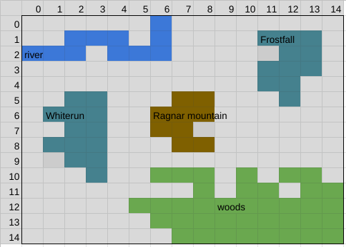
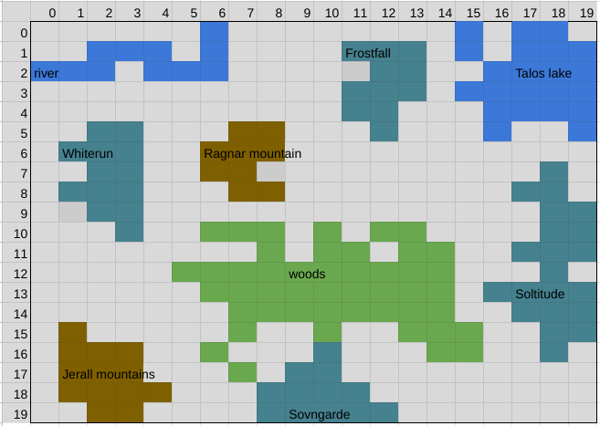
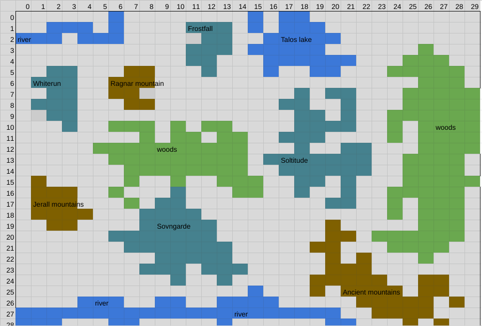

# Spyrim

This game is develop in Python 3, as a final project of the Python Course taken in Jalasoft.

## Considerations
It's recommendable to consider the followings:
* Make sure you have Python 3 installed in your OS.
* This game can only be played in Terminal.
* Basically, you have to write commands to play the game.
* It isn't an too much advanced game.

## Run the game.
* Clone this repository. Branch 'main' contains the stable code.
* Run the game by executing the `spyrim.py` file.
  ```bash
  $ python3 spyrim.py
  ```
* Once started, the game will expect you enter some commads. Enter `help` command to see the list of commands available.
  ```bash
  Command: help
  ```
* Enter `exit` to quit the game.
  ```bash
  Command: exit
  ```
## Game Goal
The goal is pretty simple, kill all the dragons en Spyrim, to do that, you must move around the map looking for dragons to kill.

## Game Levels
The game has three levels to play.
* Beginner
* Expert
* Pro

By default, the game starts with `begineer` level, if you want to change it, you have to add the flag `--level` or just `-l` and then, specify the level.
```bash
$ python3 spyrim.py --level pro
```
In the example above, the biggests map of the game will be charged and the dragons will be placed randomically.

Run the game with the flag `--help` or `-h` to get more help.
```bash
$ python3 spyrim.py --help
```
## Game Maps
### * Beginner map
  
### * Expert map
  
### * Pro map
  

## About the author
Develop by Caleb Espinoza G.
DevOps Engineer at Jalasoft SRL.
